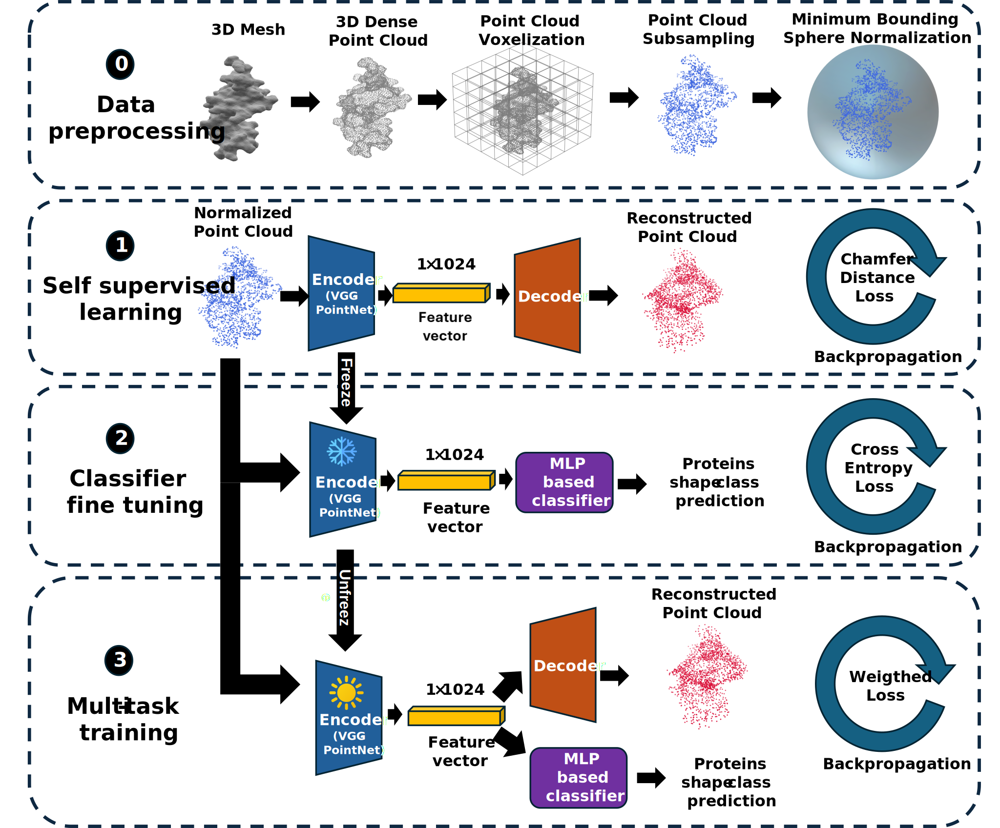

# **3D-PROSPER**

**3D** **P**rotein **R**epresentation via **O**ptimized **S**elf-supervised and **m**ulti-task **P**oint-cloud **E**ncoding for **R**ecognition

**Ruiwen HE** De Vinci Higher Education, De Vinci Research Center, Paris, France (ruiwen.he@devinci.fr)

**Halim BENHABILES** IMT Nord Europe, Institut Mines-Télécom, Univ. Lille, Centre for Digital Systems, F-59000 Lille, France (halim.benhabiles@imt-nord-europe.fr) 

**Adnane CABANI** Université de Rouen Normandie, ESIGELEC, IRSEEM, F-76000 Rouen, France (adnane.cabani@esigelec.fr)

**Karim HAMMOUDI** IRIMAS, Université de Haute-Alsace, Mulhouse, France (karim.hammoudi@uha.fr)

---

Our framework consists of four key stages: **data preprocessing**, **self-supervised learning**, **classifier fine-tuning**, and **multi-task training**. Each stage incrementally contributes to building a robust and accurate protein shape predictor, as illustrated below:

<div align="center">

</div>

---

> **GRSI Compliance:**
> This repository contains all scripts/notebooks and a step-by-step guide for complete reproducibility of our results.
> The code can be executed using **Google Colab GPU runtime** (recommended) or locally.

---

## **1. Project Overview**

**3D-PROSPER** is a point-cloud-based deep learning framework for **protein shape prediction**. The pipeline converts protein meshes into normalized point clouds and trains a **self-supervised autoencoder** using a **VGG-ProteinNet encoder** (VGG-style depth with **PointNet T-Net** modules), followed by **classifier fine-tuning** and **joint multi-task training** (reconstruction + classification).

### **Stages**

1. Data Preprocessing
2. Self-Supervised Learning
3. Classifier Fine-Tuning
4. Multi-Task Training

**Dataset split:** 80% training / 20% validation (stratified) using the official SHREC track dataset.

---

## **2. Method Summary**

* **Step 0 – Preprocessing:** Convert protein mesh → point cloud using **voxel-based subsampling (2048 points)**; normalize to a **zero-centered unit sphere** (minimum bounding sphere) for scale and translation invariance.
* **Step 1 – Self-Supervised Learning:** Autoencoder with **VGG-ProteinNet encoder** (includes **T-Nets**) and a decoder trained with **Chamfer Distance loss**.
* **Step 2 – Classifier Fine-Tuning:** Freeze encoder; train **MLP classification head** with **cross-entropy loss**.
* **Step 3 – Multi-Task Training:** Unfreeze encoder; jointly optimize **Chamfer Distance + cross-entropy** (weighted sum).

**Runtime (per protein, test set size = 2321):**

* Preprocessing: **0.242 s**
* Inference (Step 2/3): **0.082 s**

---

## **3. Repository Structure**

```
├── prepa_données.ipynb        # Step 0: Data preprocessing (mesh → 2048-point cloud, normalization)
├── pointnet_enco_deco.ipynb   # Steps 1–3: Autoencoder, classifier fine-tuning, multi-task training
├── data/
│   ├── raw/                   # Original SHREC meshes (.off/.ply/.obj)
│   └── processed/             # Preprocessed point clouds (Step 0 outputs)
├── results/                   # Trained weights, logs, figures
├── requirements.txt           # Python dependencies
├── run.sh                     # Headless execution script
└── README.md                  # This file
```

> **If you cloned the official super-repository with submodules**, run:
>
> ```bash
> git submodule update --init --recursive
> ```

---

## **4. Environment & Dependencies**

* **Primary environment:** **Google Colab GPU runtime**
* **Local environment (optional):** Python 3.9+, CUDA-enabled GPU recommended

**Core dependencies:**

```
tensorflow >= 2.10
keras >= 2.10
numpy
pandas
scikit-learn
matplotlib
tqdm
trimesh
pyvista
scipy
```

Install locally:

```bash
pip install -r requirements.txt
```

---

## **5. Dataset Preparation**

Use the **official SHREC track dataset** (as provided by organizers). If redistribution is restricted, download using the official link.

**Expected directory structure:**

```
data/
  raw/
    train/<class_name>/*.off|*.ply|*.obj
    val/<class_name>/*.off|*.ply|*.obj
    test/<class_name>/*.off|*.ply|*.obj
  processed/
    points_train.npz
    points_val.npz
    points_test.npz
```

The preprocessing notebook (`prepa_données.ipynb`) reads meshes from `data/raw/` and writes normalized 2048-point clouds to `data/processed/`.

---

## **6. Reproducibility – Step-by-Step Execution Guide**

We provide **three execution options**:

---

### **A) Google Colab (Recommended)**

1. Open these notebooks in Colab:

   * `prepa_données.ipynb` (Step 0)
   * `pointnet_enco_deco.ipynb` (Steps 1–3)

2. Enable GPU:
   *Runtime → Change runtime type → Hardware accelerator → GPU*

3. (Optional) Mount Google Drive if using Drive for data:

```python
from google.colab import drive
drive.mount('/content/drive')
```

Then set working directory:

```python
import os
os.chdir('/content/drive/MyDrive/3d-prosper')  # Path to repo root
```

4. Install dependencies (if needed):

```python
!pip install numpy pandas scikit-learn matplotlib tqdm trimesh pyvista scipy
```

5. Verify GPU availability:

```python
import tensorflow as tf
print(tf.__version__)
print(tf.config.list_physical_devices('GPU'))
```

You should see a GPU listed.

6. **Run Step 0: Data Preprocessing**

* Open `prepa_données.ipynb`, set configuration variables:

```python
DATA_RAW = 'data/raw'
DATA_OUT = 'data/processed'
N_POINTS = 2048
```

* Execute all cells. Outputs:

```
data/processed/
  points_train.npz
  points_val.npz
  points_test.npz
```

* Quick validation:

```python
import numpy as np
arr = np.load('data/processed/points_train.npz', allow_pickle=True)
print(arr.files)
```

7. **Run Steps 1–3: Model Training**

* Open `pointnet_enco_deco.ipynb`, set configuration:

```python
DATA_PROCESSED = 'data/processed'
RESULTS_DIR = 'results'
SEED = 42
AE_EPOCHS = 100
CLS_EPOCHS = 50
MT_EPOCHS = 100
```

* Train autoencoder, classifier, and multi-task model in sequence.
* Best weights saved to:

```
results/ckpt_best.h5
```

8. **Measure inference speed:**

```python
import time
t0 = time.time()
_ = model.predict(sample[np.newaxis, ...])
print('Inference time per protein:', time.time() - t0)
```

Expected: \~0.082 s/protein.

---

### **B) Local Interactive (Jupyter)**

```bash
git clone https://gitlab.com/your-repo.git
cd your-repo
python -m venv .venv && source .venv/bin/activate
pip install -r requirements.txt
jupyter notebook prepa_données.ipynb
jupyter notebook pointnet_enco_deco.ipynb
```

Run cells in the same order as in Colab.

---

### **C) Headless / Batch Mode**

```bash
# Preprocessing
jupyter nbconvert --to notebook --execute prepa_données.ipynb \
  --ExecutePreprocessor.timeout=0 --output prepa_données_EXECUTED.ipynb

# Training
jupyter nbconvert --to notebook --execute pointnet_enco_deco.ipynb \
  --ExecutePreprocessor.timeout=0 --output pointnet_enco_deco_EXECUTED.ipynb
```

---

## **7. Expected Outputs**

* `data/processed/*.npz`: Normalized point clouds `(N, 2048, 3)`
* `results/ckpt_best.keras`: Best model weights
* `results/*.png`: Training curves
* Console logs:

  * Chamfer Distance
  * Validation Accuracy
  * Inference Time (≈0.082 s/protein)

---

## **8. Hardware Requirements**

All experiments were conducted on **Google Colab GPU runtime**:

* CPU: Intel Xeon @ 2.20 GHz
* RAM: 13 GB
* GPU: NVIDIA Tesla **K80** (12 GB GDDR5)
* CUDA: Default Colab version

> The pipeline is fully reproducible on Colab without additional setup.

---

## **9. Troubleshooting**

* **No GPU detected:** Ensure Colab GPU is enabled.
* **Mesh reading error:** Check file extensions (`.off`, `.ply`, `.obj`).
* **Point count mismatch:** Confirm `N_POINTS = 2048`.
* **OOM errors:** Reduce batch size or use Colab Pro.
* **Version mismatch locally:** Prefer Colab for consistent environment.

---

## **10. Performance Summary**

| Stage         | Time (s) |
| ------------- | -------- |
| Preprocessing | 0.242    |
| Inference     | 0.082    |

Test set size: **2321 proteins**

---


### **Included Supporting Files**

**`requirements.txt`**

```
tensorflow>=2.10
keras>=2.10
numpy
pandas
scikit-learn
matplotlib
tqdm
trimesh
pyvista
scipy
```

**`run.sh`**

```bash
#!/usr/bin/env bash
set -euo pipefail

# 1) (Optional) create venv
# python -m venv .venv && source .venv/bin/activate

# 2) Install dependencies
pip install -r requirements.txt jupyter

# 3) Ensure directories exist
mkdir -p data/processed results

# 4) Execute notebooks non-interactively
jupyter nbconvert --to notebook --execute prepa_données.ipynb \
  --ExecutePreprocessor.timeout=0 --output prepa_données_EXECUTED.ipynb

jupyter nbconvert --to notebook --execute pointnet_enco_deco.ipynb \
  --ExecutePreprocessor.timeout=0 --output pointnet_enco_deco_EXECUTED.ipynb
```


Do you want me to **prepare a GitLab submission checklist** (so you don’t miss anything before uploading)? Or should I **generate a zipped final structure** with all these files included?
